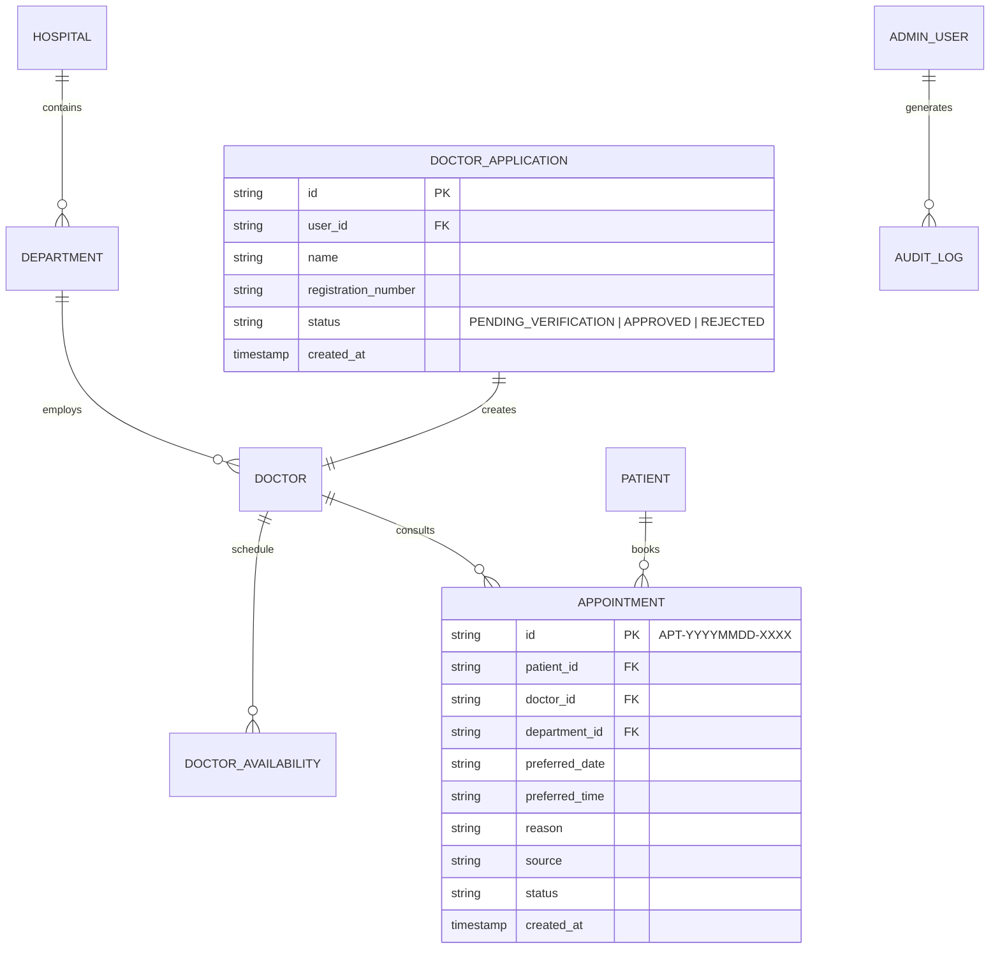

# Relational Database Schema & Entities

The platform uses a relational entity model compatible with PostgreSQL.

## Entities

1. `hospitals`: Name, address, phone, emergency phone, email, hours, map URL, stats.
2. `departments`: ID, name, code, description, icon, active.
3. `doctors`: ID, user_id, name, qualification, designation, specialization, department_id, experience, registration_number, active.
4. `doctor_applications`: ID, user_id, name, email, phone, qualification, specialization, registration_number, bio, status, reviewed_by, reviewed_at.
5. `doctor_availabilities`: ID, doctor_id, weekly_schedule (JSON), unavailabilities (JSON).
6. `patients`: ID, name, email, phone, password_hash, dob, gender.
7. `appointments`: ID (`APT-YYYYMMDD-XXXX`), patient_id, doctor_id, department_id, preferred_date, preferred_time, reason, source, status, notes (JSON), idempotency_key.
8. `admin_users`: ID, username, email, password_hash, role, status, active.
9. `audit_logs`: ID, actor_json, action, entity, entity_id, timestamp, details_json.
